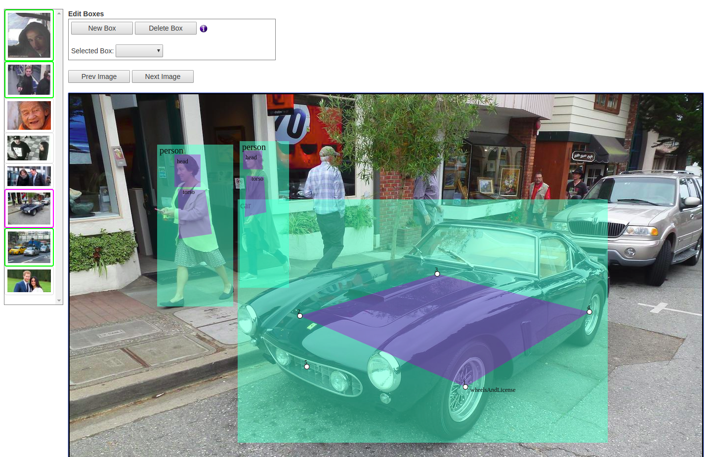

## Intro


The YOLO GUI is a simple web app that is built on [Darkflow](https://github.com/thtrieu/darkflow).

As an admin, you can kick off a job that will:
- run darkflow on a set of images in a folder.
- divide the images with their json annotations into batches.
- create a Redmine issue for each batch, containing a URL to the YOLO GUI for that specific batch.

As an annotator, you access the generated URL on Redmine.
This opens the YOLO GUI. From there, you can:
- View darkflow's annotations on the images, drawn dynamically.
- Create new boxes and annotations.
- Modify or delete existing boxes and annotations.
- Your work is automatically saved to the server as you navigate from one image to the other.
- When you have finished working on all images, you can update the Redmine issue to a "Done" status.

<p align="center">  </p>

## Dependencies

For Darkflow: Python3, tensorflow 1.0, numpy, opencv 3.
For YOLO GUI: Django 3.5, for production env: Nginx and Gunicorn

### Getting started
1- Clone this repository. Install all dependencies.

2- Build darkflow:
    ```
    python3 setup.py build_ext --inplace
    ```

2- Setup Nginx and Gunicorn (to be detailed later).

3- Setup an FTP account and a folder for uploading images.

4- Setup the YOLO GUI by modifying the settings in each of the files yolo_admin, _app, _redmine, and _settings.py.